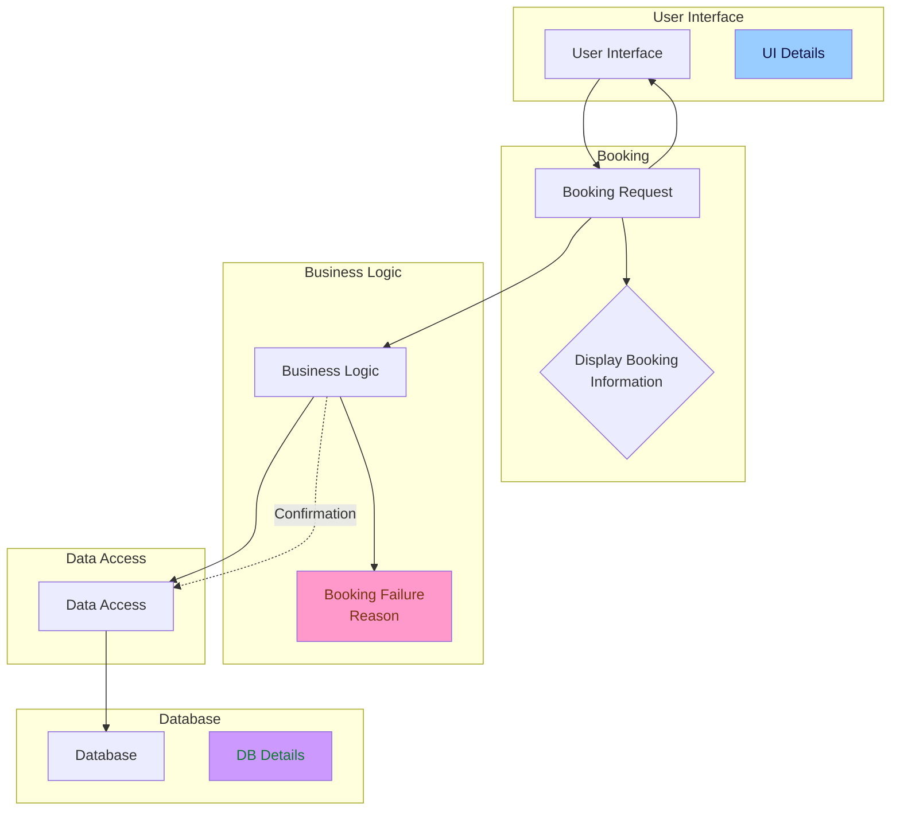

## Backend

Programming Language: ***C#***  
Database: ***SQLite***  
Framework: Consider using a lightweight framework like ***Dapper*** for simplified database interaction.
Components:

## Data Access Layer (DAL)

Use Dapper to interact with the SQLite database.  
Define functions to:
Get available slots: Retrieve available time slots for a specific date and ground from the database.  
Book a slot: Mark a selected slot as booked in the database, including user information (if applicable).
(Optional) Retrieve booking history.  

## Business Logic Layer (BLL)

### Manage core functionalities like:
Slot booking: Validate user input, interact with the DAL to check slot availability, and book the slot if available.  

(Optional) Implement functionalities like recurring bookings, cancellation policy, and user management.
Frontend (Future Implementation):

## Technology options
Windows Forms: Suitable for a simple desktop application.  
WPF (Windows Presentation Foundation): Offers a more modern and visually appealing UI for desktop applications.  
ASP.NET MVC: Can be used to create a web application accessible from any device.  
Considerations: Choose based on your client's preference, your development experience, and the desired level of visual appeal.  
Android App (Future Implementation):

Use Xamarin: A framework that allows you to develop cross-platform apps using C#.  
Leverage existing C# code: Share the backend logic (DAL and BLL) between the Windows application and the Android app, reducing development time.  
Develop Android-specific UI: Design a user-friendly interface for the Android app using appropriate Android development tools.  

## Additional Considerations:

Security: Implement basic security measures in the backend to prevent unauthorized access and data manipulation. Consider user authentication and authorization if managing user accounts becomes necessary.  

## Deployment
Windows application: Package the application as a standalone executable (.exe file) for Windows machines.
Web application: Deploy the application to a web server and make it accessible through a web browser.
Android app: Once developed, package the app and publish it to the Google Play Store.

